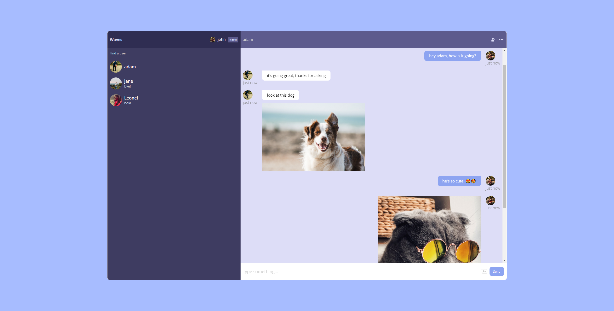

# Waves - Simple chat app

This is a simple chat app built with [React](https://reactjs.org/) and [Firebase](https://firebase.google.com/).

## Screenshot

## Features

-   Register a new user with an email and password
-   Login with an existing user
-   Logout
-   Create a new chat with another user
-   Send messages in a chat
-   Send images in a chat

## Usage

You can use this app by going to [https://chat-app-2a059.web.app/](https://chat-app-2a059.web.app/).

## Development

To run this app locally, you need to have [Node.js](https://nodejs.org/) installed.

1.  Clone this repository
2.  Run `npm install` to install the dependencies
3.  Run `npm start` to start the development server
4.  Open [http://localhost:3000](http://localhost:3000) to view it in the browser

## Deployment

To deploy this app, you need to have [Firebase CLI](https://firebase.google.com/docs/cli) installed.

1.  Run `npm run build` to build the app for production
2.  Run `firebase login` to login to your Firebase account
3.  Run `firebase init` to initialize a Firebase project
4.  Run `firebase deploy` to deploy the app

## License

This project is licensed under the MIT License - see the [LICENSE](LICENSE) file for details
